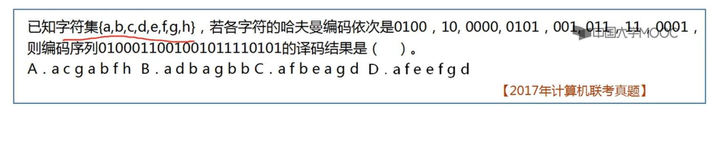
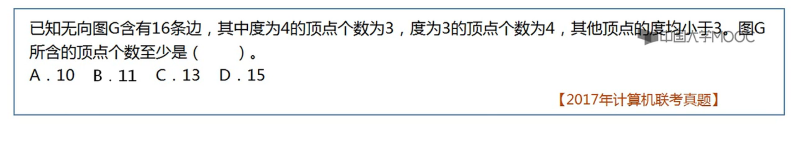
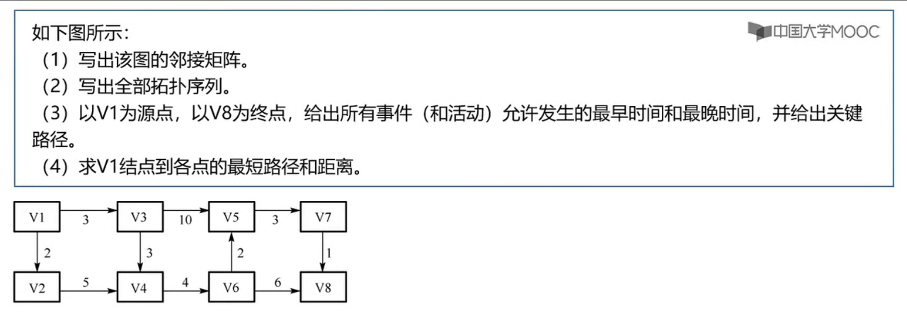
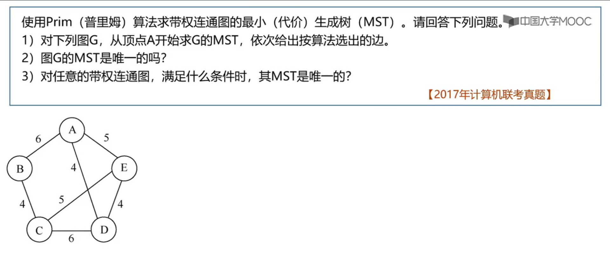
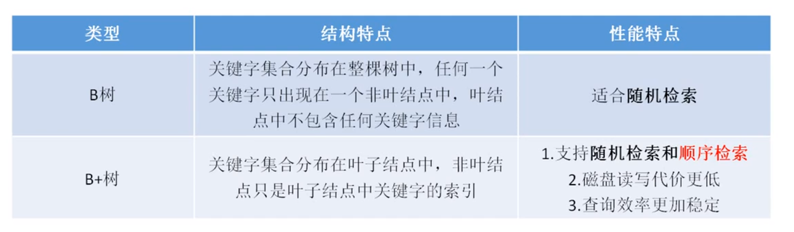
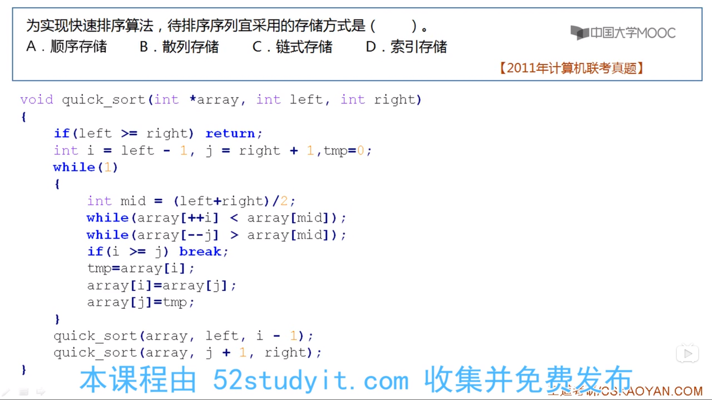

疑惑点：链式存储结构比顺序存储结构能更方便地表示各种逻辑结构

小技巧：一般求不可能实现的操作或方法，从第四个选项开始推
头指针的含义：链表的头


堆栈，n个元素进栈，不同的出栈序列个数：卡特兰数 

$$  \frac {1} {n+1} C _{2n} ^n = \frac {1} {n+1} \frac {(2n)!} {n! \times n!} $$

```math
    \frac{1}{n+1}C_{2n}^n=\frac{1}{n+1}\frac{(2n)!}{n! \times n!}
```

### 运算符优先级 
isp 栈内优先级 ;
icp 栈外优先级

| 操作符 | #    | (    | *,/  | +,-  | )    |
| ---- | ---- | ---- | ---- | ---- | ---- |
| isp    | 0    | 1    | 5    | 3    | 6    |
| icp    | 0    | 6    | 4    | 2    | 1    |

后序遍历树的非递归实现
```c
void PostOrder(BiTree T)
{
    InitStack(S);
    p=T;
    r=NULL;
    while(p||!IsEmpty(S))
    {
        if(p)						//走到最左边
        {
            push(S,p);
            p=p->lchild;
        }
        else 						//向右
        {
            GetTop(S,p);			//取栈顶结点
            if(p->rchild && p->rchild != r)		//如果右子树存在，且未被访问过
            {   p=p->rchild;		//转向右
            	push(S,p);			//压入栈
            	p=p->lchild;		//再走到最左
            }
            else					//否则，弹出结点并访问
            {
                pop(S,p);			//将结点弹出
                visit(p->data);		//访问该结点
                r=p;				//记录最近访问过的结点
                p=NULL;				//结点访问完后，重置 p 指针
            }
        }//else
    }//ehile
}

```

求二叉树高度
```c
递归算法
递归算法
int Btdepth2(BiTree T)
{
    if(T==NULL)	return 0;
    ldep=Btdepth(T->lchild);
    rdep=Btdepth(T->rchild);
    if(ldep>rdep)
        return ldep+1;
    else
        return rdep+1;
}
```

```c
非递归算法
    int Btdepth(BiTree T)
    {
        //使用层次遍历的方法
        if(!T)  return 0;
        int front=-1,rear=-1;
    	int last =0,level=0;			//last指向下一层最后一个结点的位置
    	BiTree Q[MaxSize];				//队列 Q
    	Q[++rear]=T;					//根结点入队
    	BiTree=p;
    	while(front<rear)				//队不空，则循环
        {
            p=Q[++front];				//出队
            if(p->lchild)
                Q[++rear]=p->lchild;
            if(p->rchild)
                Q[++rear]=p->rchild;
            if(front==last)				//该层最右结点
            {
                level++;
                last=rear;				//last指向下层最右结点
            }
        }
    	return level;
    	
    }
```


### 哈夫曼树

特点: 没有度为 1 的结点





无向图边数的两倍等于各顶点度数的总和

### 拓扑排序

入度为 0





Dijkstra 求最短路径

Floyd 最短路径

拓扑排序 : 入度为 0 

##### 最小生成树

Prim

Kruskal




### 查找

#### 平均查找长度

一次查找的长度指要比较的关键字次数，所有关键字的比较次数的平均值

折半查找关键字不存在，比较次数最多：树高

查找失败的平均失败长度


### 树



哈希查找失败

根据散列函数值去查找失败次数

除留余数法，选择规则：取一个不大于 m 但最接近或等于 m 的 **质数 P **

### KMP 算法

部分匹配表

部分匹配值： 前缀和后缀的最长的共有元素的长度


### 排序

快速排序实现



### 排序

#### 插入排序

插入排序需要哨兵

- 直接插入排序
- 折半插入排序
- 希尔排序

####　交换排序

- 冒泡排序

- 快速排序  递归实现，空间复杂
  $$
  log_2 n
  $$


#### 选择排序

- 简单选择排序
- 堆排序

归并排序

基数排序

### 查找

顺序查找

