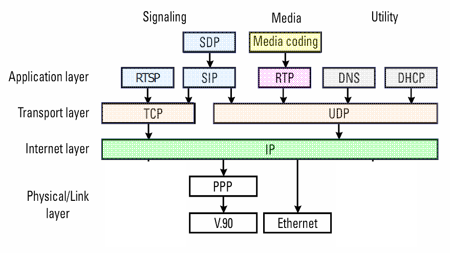

工作中时常能听到 SIP 协议的名字，但对这个协议始终没有了解，这次便仔细地把这块协议了解一下

SIP 协议

SIP（Session Initiation Protocol，会话初始化协议）是由 IETF（Internet EnGineering Task Force，因特网工程任务组）制定的多媒体通信协议，是一个在 IP 网络上进行多媒体通信的应用层控制协议，它被用来创建、修改和中介一个或多个参加者参加的会话进程，与 SDP、TRP/TRCP、DNS 等协议配合，共同完成 IMS 中的会话建立与媒体协商。SIP 协议广泛应用于 CS（Circuit Switched，电路交换）、NGN（Next Generation Network，下一代网络）以及 IMS（IP Mutimedia Subsystem，IP 多媒体子系统）的网络中，可以支持并应用于语音、视频、数据等多媒体业务，同时也可以应用于 Presence（呈现）、Instant Message（即时消息）等特色业务。可以说，有 IP 网络的地方就有 SIP 协议的存在。

SIP 协议在协议栈中的位置



SIP 协议虽然属于应用层协议，然而 SIP 本身不提供任何服务。但是 SIP 是通信的基础，在 SIP 这个通信的基础上可以用来构建不同的服务。SIP 协议在建立和位置多媒体会话中，主要支持如下5个功能：

- 检查终端用户的位置。无论被叫放在哪里均能确保呼叫达到被叫放，进行任何描述信息到定位信息的转换；
- 检查用户参与会话的意愿程度。参与者在呼叫中能够引入其他用户加入或取消其他用户的连接；
- 检查媒体和媒体参数，允许与呼叫有关的组在支持特性上保持一致；
- 在呼叫与被叫双方建立会话；
- 发送和终止会话，修改会话参数，激活服务等会话管理操作；

SIP 协议特性

- 文本协议：易于调测，结构灵活
- 点对点协议：只需要一个相对简单（因此也高度可扩展的）核心网络
- 中性的底层传输协议：可用 TCP/UDP（推荐 UDP）
- 同时呼叫和媒体信息同时传送：媒体信息的传送由 SDP 传送
- 与许多其他协议协同工作，仅涉及通信会话的信令部分（control message）

SIP 相关协议

RTP（实时传输协议）

SDP（会话描述协议）：描述了会话所使用流媒体细节，如：使用哪个 IP 端口，采用哪种编解码器等等

SIP 协议的一个典型用途：

SIP “会话”传输一些简单的经过封包的实时传输协议。RTP 本身才是语音或视频的载体。

## 业务过程和协议流程

注册流程

```sequence
title:SIP 注册流程

终端代理 A --> 代理服务器:REGISTER(1)
代理服务器 --> 终端代理 A:401(2)
终端代理 A --> 代理服务器:REGISTER(3)
代理服务器 --> 终端代理 A:200 OK(4)
```

1. 用户首次试呼时，终端代理 A 向代理服务器发送 REGISTER 注册请求；
2. 代理服务器通过后端认证/计费中心获知用户信息不再数据库中，便向终端代理回送401 Unauthorized 质询消息，其中包含安全认证所需的令牌；
3. 终端代理提示用户输入其标识和密码后，根据安全认证令牌将其加密后，再次用 REGISTER 消息报告给代理服务器；
4. 代理服务器将 REGISTER 消息中的用户信息解密，通过认证/计费中心验证其合法后，将该用户信息登记到数据库中，并向终端代理返回成功响应消息200 OK。


注销流程

```sequence

终端代理 --> 代理服务器:REGISTER(1)
代理服务器 --> 终端代理:200 OK(2)
```

1. 终端向代理服务器发送 REGISTER 消息注销，其中 EXPIRE 字段设置为0；
2. 代理服务器在收到后送回 200 OK 响应，并将数据库中的用户有关消息注销。

基本呼叫建立过程

```sequence
participant 终端代理 A
participant 代理服务器
participant 终端代理 B
终端代理 A --> 代理服务器: Invite(1)
代理服务器 --> 终端代理 B: Invite(2)
代理服务器 --> 终端代理 A: 100 Trying(3)
终端代理 B --> 代理服务器: 100 Trying(4)
终端代理 B --> 代理服务器: 180 Ringing(5)
代理服务器 --> 终端代理 A: 180 Ringing(6)
终端代理 B --> 代理服务器: 200 OK(7)
代理服务器 --> 终端代理 A: 200 OK(8)
终端代理 A --> 代理服务器: ACK(9)
代理服务器 --> 终端代理 B: ACK(10)
终端代理 B -- 终端代理 A: 通话(11)
终端代理 A -- 终端代理 B: 通话(11)
```

1. 用户摘机发起一路呼叫，终端代理 A 向该区域的代理服务器发起 Invite 请求；
2. 代理服务器通过认证/计费中心确认用户认证已通过后，检查请求消息中的 Via 头域中是否已包含其地址。若已包含，说明发生环回，返回只是错误的应答；若没有问题，代理服务器在请求消息的 Via 头域插入自身地址，并向 Invite 消息的 To 头域所指示的被叫终端代理 B 发送 Invite 请求；
3. 代理服务器向终端代理 A 发送呼叫处理中的应答消息：100 Trying（防止请求发送到终端代理 B 时，终端代理 A 已经超时）；
4. 终端代理 B 向代理服务器发送呼叫处理中的应答消息：100 Trying；
5. 终端代理 B 指示被叫用户振铃，用户振铃后向代理服务器发送 180 Ringing 振铃消息；
6. 代理服务器向终端代理 A 转发被叫用户振铃消息；
7. 被叫用户摘机，终端代理 B 向代理服务器返回表示连接成功的应答 200 OK；
8. 代理服务器向终端代理 A 转发该成功指示 200 OK；
9. 终端代理 A 收到信息后，向代理服务器发送 ACK 消息进行确认；
10. 代理服务器将 ACK 确认消息转发给终端代理 B；
11. 主被叫用户之间建立通信连接，开始通话。

正常呼叫释放流程

```sequence
participant 终端代理 A
participant 代理服务器
participant 终端代理 B

终端代理 A --> 终端代理 B: 通话(1)
终端代理 B --> 代理服务器: Bye(2)
代理服务器 --> 终端代理 A: Bye(3)
终端代理 A --> 代理服务器: 200 OK(4)
代理服务器 --> 终端代理 B: 200 OK(5)
```

1. 正常呼叫
2. 用户通话结束后，被叫用户挂机，终端代理 B 向代理服务器发送 Bye 消息；
3. 代理服务器转发 Bye 消息至终端代理 A,同时向认证、计费中心发送用户通话的详细信息，请求计费；
4. 主叫用户挂机后，终端代理 A 向代理服务器发送确认挂断相应信息 200 OK；
5. 代理服务器转发响应信息 200 OK.

会话更改流程


---------------------------------------------------------------------------------------------------------------------------------------------------------------------------------------------------------------------

参考文献

[1]. (会话初始化协议（SIP）简介及应用)https://www.ibm.com/developerworks/cn/opensource/os-cn-sip-intro/index.html

[2]. （SIP协议详解）https://www.cnblogs.com/xiaxveliang/p/12434170.html

[3]. （SIP 协议呼叫流程详解）https://yq.aliyun.com/articles/243203